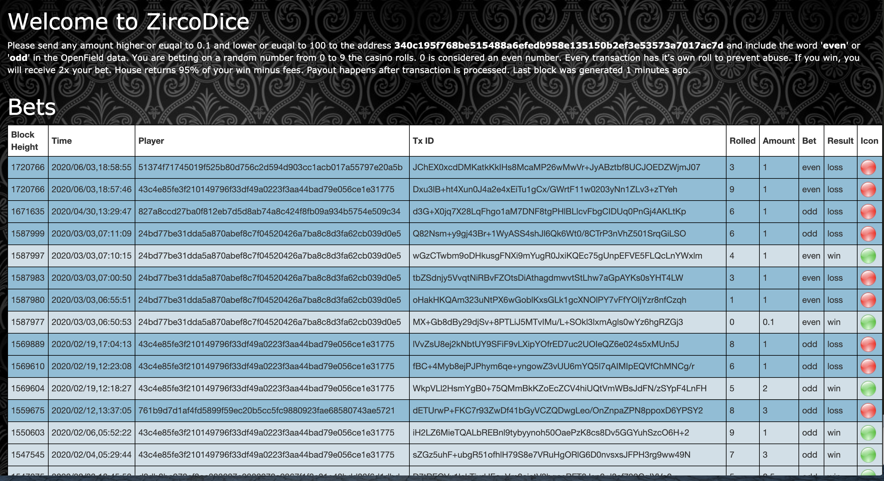

# Proof of Concept

## Zircodice: A simple flip coin game with Bismuth  

**Demo URL**  
http://167.86.120.22:1212/

**Github repository**  
https://github.com/hclivess/BismuthProjects/tree/master/zircodice

Zircodice is an application that runs on a server and reads the Bismuth blockchain periodically. It looks for the following type of a message: 

1. BIS sent to a specific address to which the Zircodice operator has access  
2. For that transaction, openfield must say either "odd" or "even"  

When these conditions are met, Zircodice runs a function to generate a random number from 0 to 9. If the number returned by this function is even and the transaction opendield says "even", user wins. 

The application proceeds to save the roll and the payout to a database, constructs a payout transaction and hereby sends funds to the user.

If these fields mismatch, bank keeps the bet amount to itself.

Every transaction receives it's own roll. Rolls are not shared for blocks.
Previously, rolls were based on the last number of a block hash, but this approach has been discontinued because it was proven insecure.
