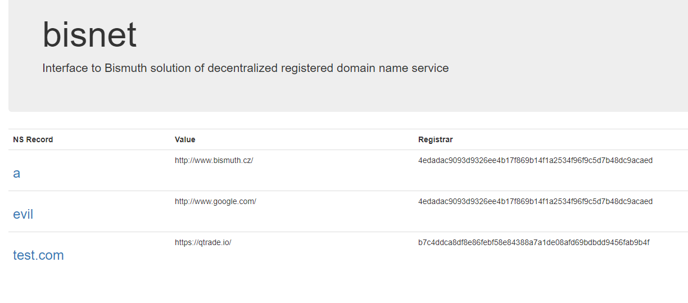

# Welcome to bisnet

**bisnet** is a name registration service on the Bismuth blockchain. You can use it in order to register your entries, which can either be IPs directly, redirects or masks of entire links.
There are currently no DNS services integrating **bisnet** that we are aware of. It is currrently not possible to transfer or change entries, only to register them.
By running **bisnet.py**, you can check for the current existing entries at [http://127.0.0.1:4682](http://127.0.0.1:4682)

To register your **bisnet** entry, you need to send a transaction to the Bismuth network with the following properties:

* **operation:** domain
* **data:** name:value

Example:

* **operation:** domain
* **data:** mybestdomain.com:http://www.google.com

You need to adjust path to your ledger in _config.txt_ and your node must be running.

##  For more information and the actual software, please head to [https://github.com/bismuthfoundation/bisnet](https://github.com/bismuthfoundation/bisnet)
